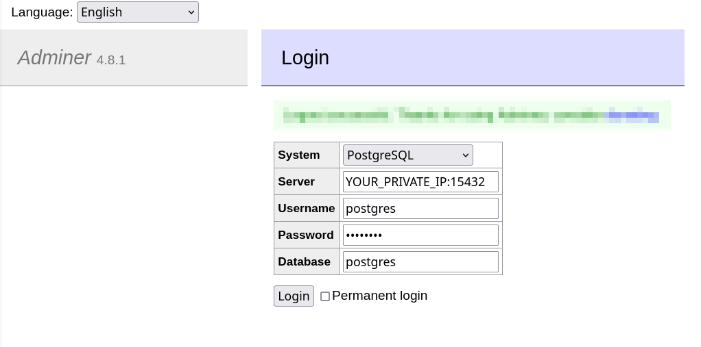

# Decentralized Price Oracle System

## How nodes work:

1. Obtain keys to sign messages from the file `$NODE_NAME.priv` or generate a new one and save it to `$NODE_NAME.priv` file.

2. Start discovering p2p nodes. The node will print `...` on the screen until it has >=3 connected peers. If you didn't pass `-b MULTY_ADDRESS`, it will use default seed nodes provided by libp2p. This depends on your network configuration and can take some time.

3. After the node has some peers, it will connect and initialize the DB. DB credentials are saved in `.env-db` file. To run the DB server, you can use the docker-compose file `docker compose -f postgres-dc.yaml up -d`.

4. It will run a HEARTBEAT goroutine, creating and updating the node's record in the heartbeat table in the DB. This table is used to share access to the DB and decide which node can write to the DB at a moment in time.

5. Create a libp2p PubSub subscription and publish a signed Ethereum price, received from Coingecko every 10 minutes (configured with `GET_PRICE_INTERVAL_SEC` const).

6. Then runs a separate goroutine which:
    - 6.1. Listens to incoming PubSub messages from the other nodes.
    - 6.2. Signs if the price has <3 signatures.
    - 6.3. Saves to the local "cache" `preDbPrices map[uint64]Price`, the node uses it to store messages with >= 3 signatures and takes candidates to write to the DB from it.
    - 6.4. Retransmits signed messages if it has <3 signatures.

7. Runs another goroutine to write to the DB when allowed.

### How nodes share access to the DB

1. Nodes create and then update a heartbeat record in the DB every `HEARTBEAT_INTERVAL_SEC` in a separate goroutine. These are the fields:
    - `timestamp` - time of the last heartbeat
    - `nodename` - the node's name

2. In a separate goroutine `go writeToDB(ctx, db)` it checks the following conditions:
    - If it has messages to write to the DB
    - If `DB_WRITE_INTERVAL_SEC` passed since the previous write to the DB.
    - If the current node is allowed to write to the DB at the moment. To define this, we just select a node with the biggest heartbeat timestamp. *To change writing nodes time to time, we add some randomness to the heartbeat's timestamp, otherwise, it will be the same node all the time, due to heartbeats update timestamp in the same interval for all the nodes.*

## Used Libraries, Tools, and Algorithms

### Docker Compose

Docker Compose is used to simplify running the Postgres DB server and web UI to the database (Adminer). I would use docker-compose to run the nodes as well, but due to the requirement to change the number of nodes running via env var, I decided to go with just a bash wrapper script.

### libp2p Kademlia DHT

The Kademlia Distributed Hash Table (DHT), or Kad-DHT, is a distributed hash table that is designed to find nodes and data on the network by using a [routing table](https://en.wikipedia.org/wiki/Routing_table) that organizes peers based on how similar their keys are. It is a good candidate to establish and maintain connections between nodes. [Source](https://docs.libp2p.io/concepts/discovery-routing/kaddht/)

### libp2p PubSub

Based on the description of the libp2p PubSub [overview](https://docs.libp2p.io/concepts/pubsub/overview/), it is a good option to efficiently deliver messages in decentralized systems.

### Sharing access to the DB between nodes

Each node periodically updates its heartbeat's timestamp in the DB. To define which node is allowed to write to the DB, we select the node with the biggest heartbeat. This can be done independently by any node, and timestamp updates are atomic so shouldn't get race conditions. To ensure that different nodes get access, we set the timestamp to `now()+random`, so different nodes will be selected. The described approach to sharing DB access was chosen due to simplicity and time constraints, and it works nicely. During the design phase, other libraries or distributed lock managers were considered, but most of them are implemented with in-memory databases (Redis, etc.) which will make the system more complex and will add dependencies.

### Uniq and sortable Price records' Id

To be able to distinguish Price records between each other, I've added Id field to the Price struct. To generate a unique and sortable by order of creation Id, I wanted to use Twitter's snowflake approach, and found a nice implementation of the approach [here](https://github.com/sony/sonyflake#sonyflake). **NOTE:** This unique Price record's **Id** also stored in the DB to ensure that we are writing each price with >=3 signatures only once. *In the distributed system, we can have several different replicas of the same price instance with a different set of records.*

### Providing secrets

I've used `github.com/joho/godotenv` to be able to store DB credentials in a file. This approach is convinient for DEV environment, in case of a PRODUCTION application, secrets should be securaly provisioned via env vars, or somehow else.

## How to

### 1. Run DB server
Postgres DB server wrapped into a docker compose file. Also a web UI to the db added to the same compose file. To run the DB just [instal docker compose](https://docs.docker.com/compose/install/) and then run:
```
docker compose -f postgres-dc.yaml up
```
To run the command in background exec:
```
docker compose -f postgres-dc.yaml up -d
```

### 2. View data in the DB
To view the DB data open [Adminer web UI](http://localhost:8080/) in the browser.
To connect the DB you need to find you computer private IP address([wikihow](https://www.wikihow.com/Find-Out-Your-IP-Address)).  
Enter the address into the loging screen, see the pic.


Bear in mind:
1. Postgres is on not standard port **15432**
2. Password is `Zaq1Xsw2`

### 3. Run N nodes
To run several nodes simultaniously you can use `run_nodes.sh` script.
For instance to run 4 nodes you can:
```
export NUM_NODES=4
run_nodes.sh
```
or  
```
NUM_NODES=4 run_nodes.sh
```
While the nodes are running, you will see all the logs on the screen.
### 3. See logs of node X
`run_nodes.sh` runs nodes with numbers `0..$NUM_NODES` and saves each node logs to `node$N.log` file.
So for instance to see logs of only `node3` exec, the follwoing, while in the same folder from where you run `run_nodes.sh`:
```
tail -f node3.log
```

## Not implemented yet or could be improved:
* **Better errors handling** in many places errors are ignored, needs to be improved.
* **Validate Price's signatures of the other nodes with PubKey:** To validate signatures of other nodes, nodes need to share Public keys, which is not implemented currently.
* **Use the same keys for p2p and Signing**
* **Check connected node's unique identity,** to prevent several nodes with the same key
* **Check how many peers connected node**
* **Add metrics** to monitor and alert on the system events
* **Optimize messages retransmission:** despite nodes retransmit only Prices with <3 signatures, this still leads to a lot of copies of the same Prices circulating in the PubSub network; this possibly could be optimized.
* **Use logger:** should use proper logger, with configurable levels
* **Improve code:** better names, more comments, improve structure - simplifies future development and maintenance
* **manage DB with ORM**, to automate migrations and simplify requests

## Known issues
* Looks like sometimes request to coingecko fails, need to better process errors and possibly retry. Here is the error:
```
... panic: nil

goroutine 5266 [running]:
main.GetLatestEthereumPrice()
        /home/vlad/Projects/Upshot/oracle/main.go:398 +0x3e6
main.publish.func1()
        /home/vlad/Projects/Upshot/oracle/main.go:190 +0x4f
main.publish({0x15b8110, 0xc000040410}, 0xc00046f8c0, 0xc000402b10)
        /home/vlad/Projects/Upshot/oracle/main.go:210 +0x107
created by main.main
        /home/vlad/Projects/Upshot/oracle/main.go:166 +0x89b
```


Solved issues:
* Concurrent DBinit caused `2023/12/21 08:30:19 pq: duplicate key value violates unique constraint "pg_type_typname_nsp_index"`
    - Mitigation: Moved init6 SQL scripts to **init.sql** folder, so tables will be created on the DB server init.